# Getting started with Splines

## Creating the Asset
To create a spline game object there are three different methods.

In the Unity menu, go to **GameObject** > **Spline** > **New Spline**.
 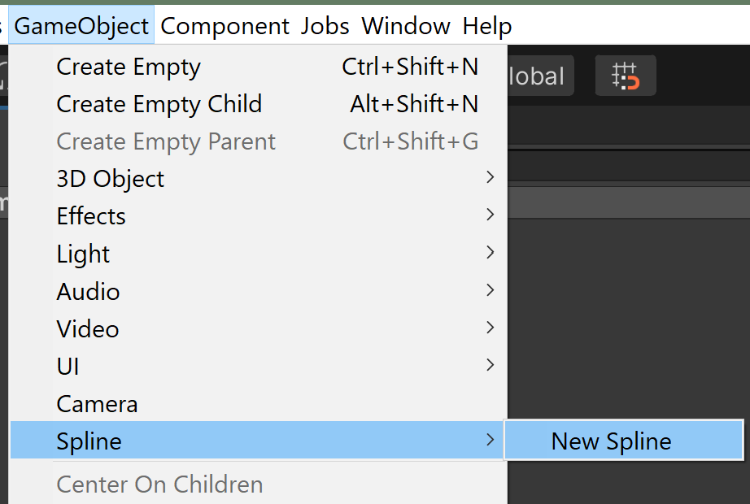

In the Hierarchy window. RMB > **Spline** > **New Spline**
 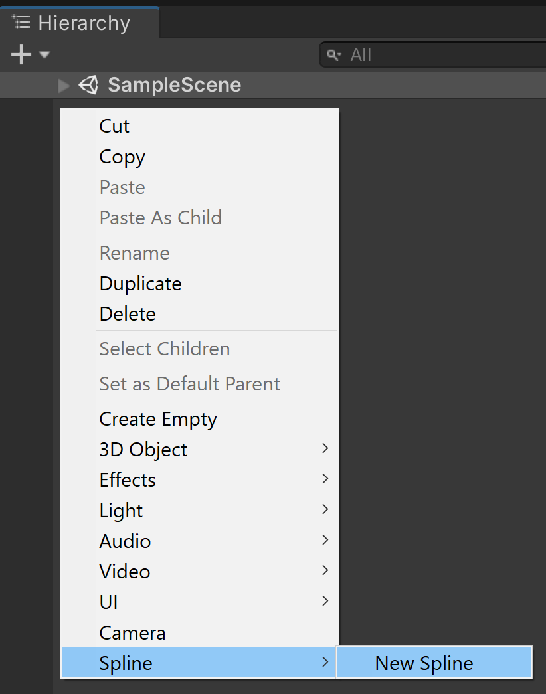

In the Inspector window, on a GameObject, **Add Component** > **Spline Container** (Script).
 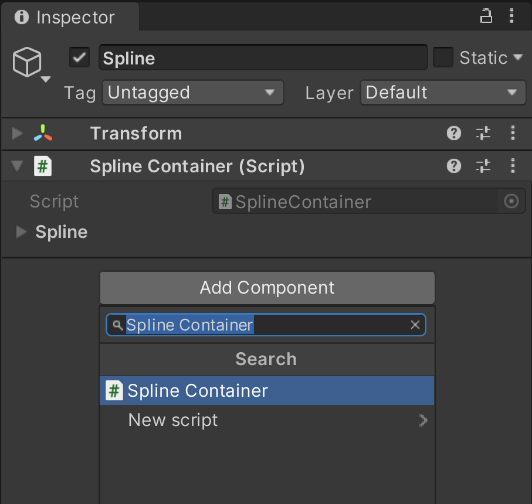

For more information, see also [Spline Container](spline-container.md).

## Component Editor Tools
The **Knot Placement**, **Knot Move**, and the **Tangent Move** tools are available in the [Component Editor Tools](https://docs.unity3d.com/Manual/UsingCustomEditorTools.html#ToolModesAccessSceneViewPanel) overlay in the Scene window. The **Knot Placement** tool will be automatically engaged after the spline is created with the Unity menu or the Hierarchy window.
 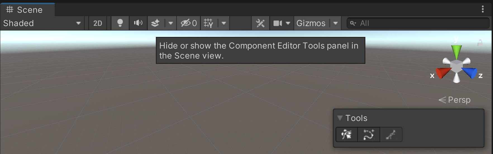

### Knot Placement Tool
Use the **Knot Placement** tool to add knots. 

When the tool is engaged, you can place knots on a surface, such as, a Terrain object or a mesh face.
 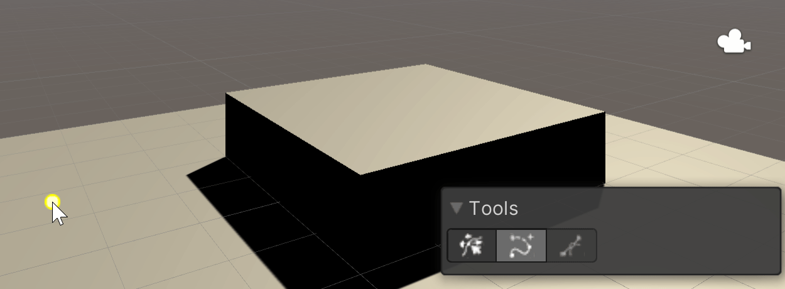

Clicking on the first point will close the spline.
 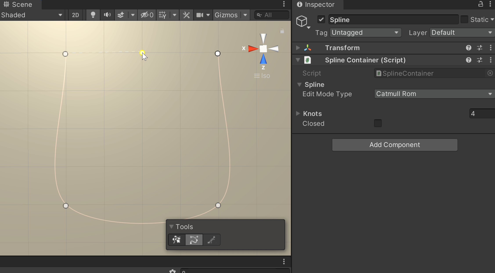

Placing knots not on a surface will place it on the grid instead.

Use **Ctrl** + **z** to delete the last created knot.

Use the **Esc** key to exit the **Knot Placement** creation.

### Knot Move Tool
Use the **Knot Move** tool to move knots.

You can then select one or more knots to get a position handle to move them around.
 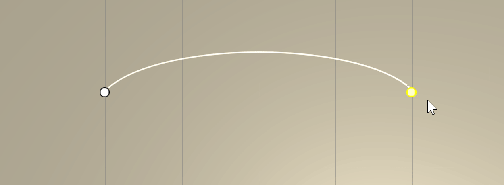

Clicking on the spline will create a new knot.
 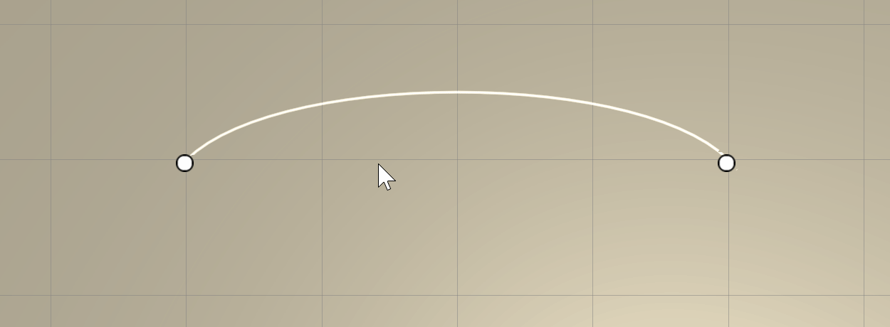

Selecting a knot and then pressing the delete key will delete the knot.
 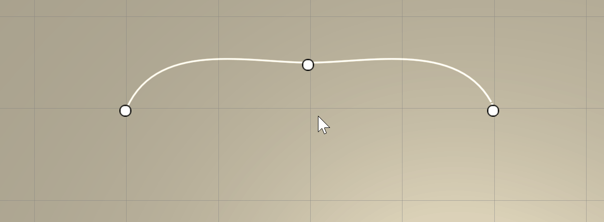

### Tangent Move Tool
Use the **Tangent Move** tool to move knot tangents. 

This can tool can only be engaged when in the Inspector window on the Spline Container the Edit Mode Type property is set to **Bezier**.
 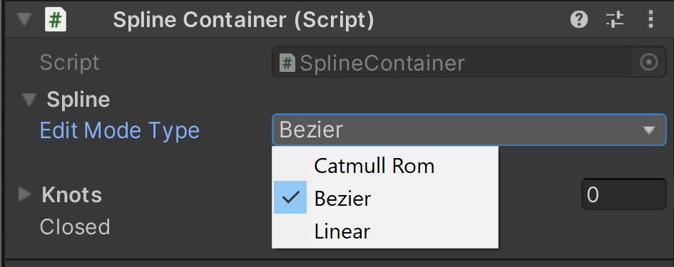

The tangent can be manipulated by moving the tangent handle.
 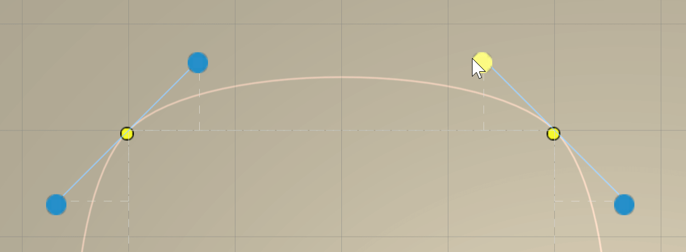

Holding Shift while using a tangent handle will display the radial rotation gizmo.
 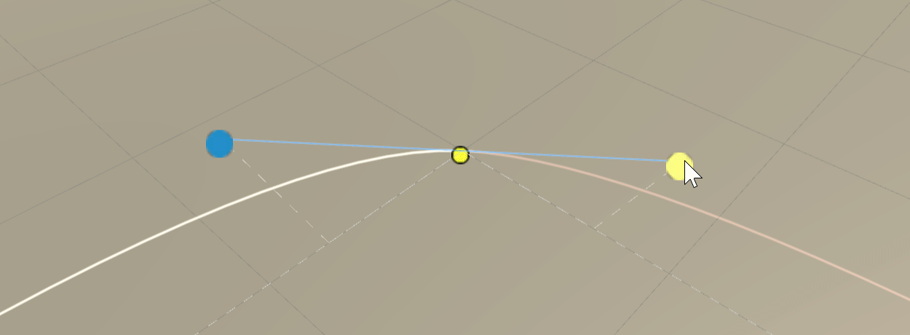
