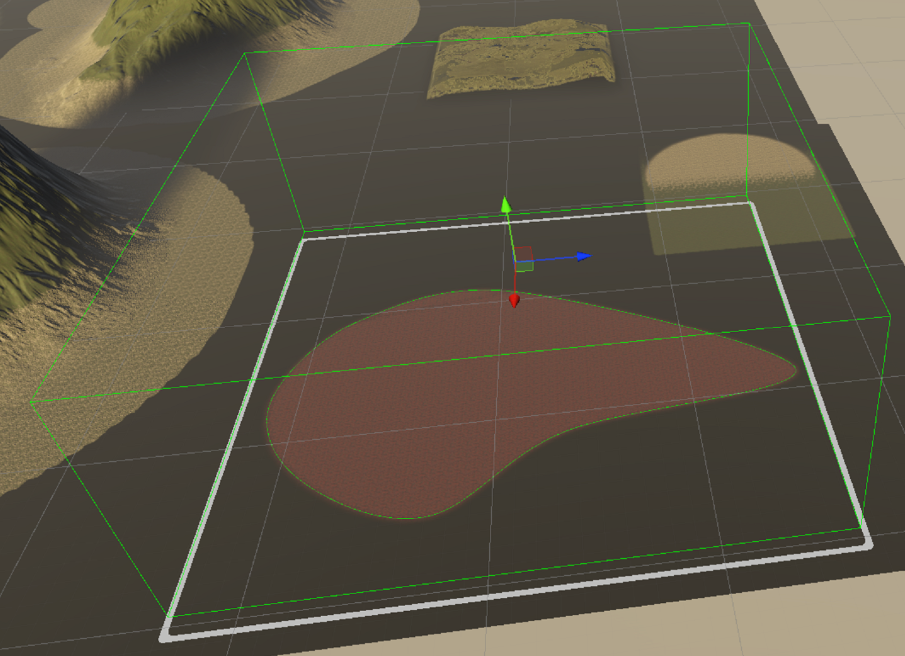

# Splines

 

The Spline package is split into two parts :
* Editor spline representation and tools that can be plugged into any data representation by creating a converter.
* Basic spline implementation that should cover most use cases.

For an introduction to the Spline package, see [Getting started with Splines](getting-started-with-splines.md).

