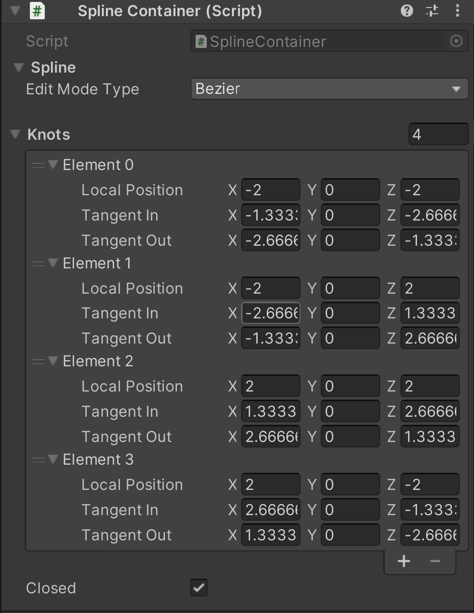

# Spline Container
 

The **Spline Container** is the component that stores the knot information and how the knots should be interpolated with **Edit Mode Type** and **Closed**. The Edit Mode Type is a list of the different methods of interpolations; **Catmull Rom**, **Bezier** and **Linear**. The per knot list contains the **Local Position** and optionally if using Bezier the **Tangent In** and **Tangent Out** values. The **Closed** property enables the spline to be interpolated as an enclosed loop instead of an open path. 

| **Property**                     | **Description**                                              |
| -------------------------------- | ------------------------------------------------------------ |
| Edit Mode Type                   | The methods to interpolate the knots into a spline; Catmull Rom, Bezier, Linear |
| Knots                            | The number of knots in the spline.                   |
| Element #                        | The per knot information.                             |
| Local Position                   | The position of the knot.                                    |
| Tangent In                       | If in Bezier mode, the inner tangent of the knot.            |
| Tangent Out                      | If in Bezier mode, the outer tangent of the knot.            |
| Closed                            | Enables the spline to be interpolated as an enclosed loop instead of an open path.|

         

